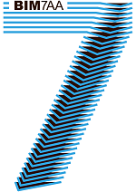

# BIM7AA

> BIM7AA TYPE CODING is a simple and operational code structure for
> building components based on consultant requirements and experience in
> design and planning, danish building norms and ”best practice” from complex
> to manageable BIM projects.

## Main Purpose ##
### What is BIM7AA Type Code? ###
BIM7AA Type Code is a simple encoding method for BIM components based on the consultant’s design
requirements, experiences, Danish way of building and best practice for all size BIM projects.
The structure in BIM7AA Type Code is a modernised version of the familiar and thoroughly tested SfB system,
modified to suit today’s requirements for managing a BIM project.
This method structures and generates cohesion between the BIM components, tender list, specification and
quantity take-offs (QTO) here by defining the interface between the consultants professions. In doing so, a
simple standardisation of the consultant´s internal methods of production is obtained, making it adaptable to
the specific project in terms of classifications, properties and other relevant parameters to each project.
BIM7AA Type Code is not developed with the intention of being a classification system – but its structure
makes it easy to use for classification purposes.
One of the purposes of BIM7AA Type Code is to meet 80-90 percent of the needs for type coding of a given
project. The remaining 10-20% is to be developed company-specific and/or project specific.
BIM7AA compiles experiences from running projects to update the Type Code.

### 7 Additional facts about the BIM7AA Type Code: ###
1. Complies with the Executive Order of CT Order 118 and 119 § 4 on requirements for structuring digital
building objects
2. Complies with the requirements for management of building models and objects cf. CF Order 118 and 119
3. Practice-oriented
4. Easy to integrate with other classification systems like DBK, CCS, IFC management - classification
5. Is a commercial viable method for building-project consultants
6. Does not require supplementary software
7. Free of charge

### Read more about BIM7AA ###
To read more about BIM7AA check out [BIM7AA-web]
## Contribute ##
BIM7AA wants to share the results of this collaboration and has therefore chosen to make the BIM7AA Type
Code available for everyone. The Type Code is already being used in ongoing projects by the companies
participating in the BIM7AA task force, who are at the same time compiling the lessons learnt from this to
make ongoing updates of the Type Codes)

## Use BIM7AA in Software ##
BIM7AA can be easily be integrated into IT systems. You will find our page for developers and software manufacturers here [BIM7AA-API][BIM7AA-API]
 on GitHub.

## License ##
MIT - The Type Code is an open-source document which is made available
free of charge. BIM7AA cannot be held liable for how the user of the Type
Code chooses to use it.

[//]: # (These are reference links used in the body of this note and get stripped out when the markdown processor does its job. There is no need to format nicely because it shouldn't be seen. Thanks SO - http://stackoverflow.com/questions/4823468/store-comments-in-markdown-syntax)
   [BIM7AA-web]: <http://bim7aa.dk/>
   [BIM7AA-API]: <https://github.com/BIM7AA/BIM7AA-API>
